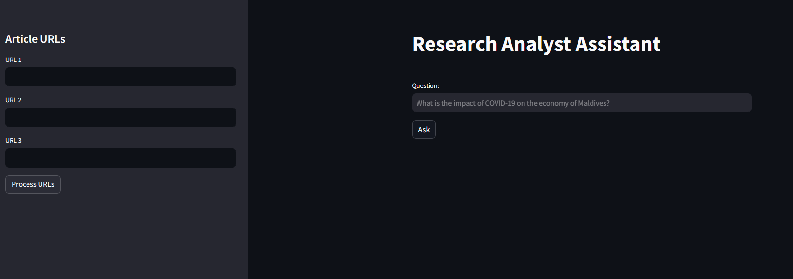
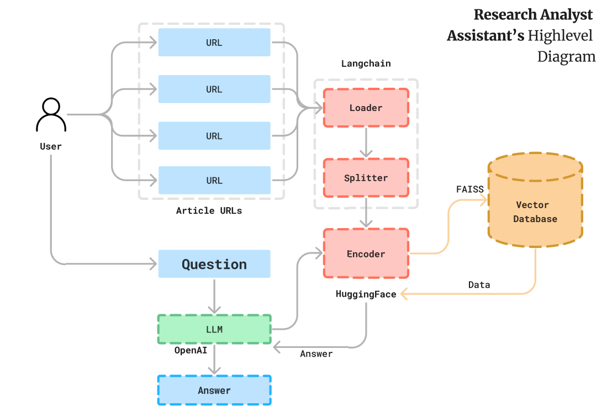

# Research Analyst Assistant

This chat bot leverages OpenAI, Langchain, and Streamlit technologies to scrape information from financial websites and provide expert analysis on equity and stocks. 

## Features:
- **OpenAI Integration**: Utilizes OpenAI's natural language processing capabilities for conversational interactions.
- **Lanchain**: Utilizes Lanchain for secure data storage and transaction.
- **Streamlit**: Employs Streamlit for creating interactive web applications.
- **Web Scraping**: Scans financial websites to gather the latest information on stocks and equity.
- **Expert Analysis**: Provides insightful analysis and answers to questions posed by research analysts in the financial field.

## Benefits:
- **Efficient Research**: Helps research analysts gather relevant information quickly.
- **Expert Insights**: Offers expert-level analysis to aid in decision-making.
- **Streamlined Interface**: User-friendly interface powered by Streamlit for seamless navigation.
- **Secure Transactions**: Ensures data security and integrity through Lanchain integration.

This tool is designed to enhance the workflow of research analysts in the financial sector, providing them with the necessary resources and insights to make informed decisions.

## Dashboard:

## High-Level Diagram:

